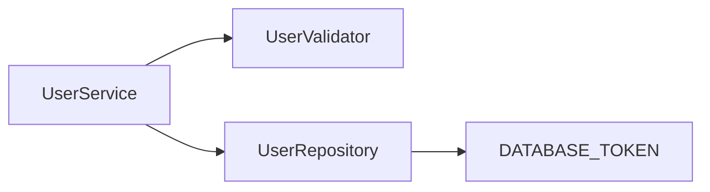

# Suites Examples

Real-world examples demonstrating [Suites](https://suites.dev) integration with popular dependency injection frameworks and test runners.

Each example showcases [solitary](https://suites.dev/docs/api-reference/testbed-solitary) and [sociable](https://suites.dev/docs/api-reference/testbed-sociable) testing patterns using the same user management domain model.

If you are new to Suites, check out the [Getting Started](https://suites.dev/docs/getting-started) guide.

## Examples

| Example                                        | DI Framework | Test Runner | Use When                                          |
| ---------------------------------------------- | ------------ | ----------- | ------------------------------------------------- |
| [nestjs-jest](./nestjs-jest)                   | NestJS       | Jest        | NestJS with Jest                                  |
| [nestjs-jest-drizzle](./nestjs-jest-drizzle)   | NestJS       | Jest        | NestJS with Jest + Drizzle ORM                    |
| [nestjs-jest-prisma](./nestjs-jest-prisma)     | NestJS       | Jest        | NestJS with Jest + Prisma ORM                     |
| [nestjs-jest-typeorm](./nestjs-jest-typeorm)   | NestJS       | Jest        | NestJS with Jest + TypeORM                        |
| [nestjs-jest-mikroorm](./nestjs-jest-mikroorm) | NestJS       | Jest        | NestJS with Jest + MikroORM                       |
| [nestjs-vitest](./nestjs-vitest)               | NestJS       | Vitest      | NestJS with Vitest                                |
| [nestjs-sinon](./nestjs-sinon)                 | NestJS       | Sinon       | NestJS with Sinon/Mocha                           |
| [inversify-jest](./inversify-jest)             | InversifyJS  | Jest        | InversifyJS with Jest                             |
| [inversify-vitest](./inversify-vitest)         | InversifyJS  | Vitest      | InversifyJS with Vitest                           |
| [inversify-sinon](./inversify-sinon)           | InversifyJS  | Sinon       | InversifyJS with Sinon/Mocha                      |
| [advanced-mock-config](./advanced-mock-config) | NestJS       | Jest        | Advanced `.mock().final()` and `.impl()` patterns |

## Quick Start

```bash
# Clone and run any example
cd nestjs-jest
pnpm install
pnpm test
```

All tests should pass immediately, demonstrating both testing strategies.

## Testing Strategies

Each example demonstrates two approaches:

### Solitary Unit Tests

```typescript
const { unit, unitRef } = await TestBed.solitary(UserService).compile();
```

Test one class in complete isolation. All dependencies are replaced with test doubles.

**When to use:**

- Testing component logic in isolation
- Controlling all inputs for predictable results

**Trade-off:** Does not verify interactions between components

### Sociable Unit Tests

```typescript
const { unit, unitRef } = await TestBed.sociable(UserService)
  .expose(UserValidator) // Use real validator
  .expose(UserRepository) // Use real repository
  .compile();
```

Test multiple classes together with their real collaborators. External I/O (databases, APIs, file systems) is replaced with test doubles to keep tests fast.

**When to use:**

- Verifying components work together correctly
- Testing interactions between business logic components

**Trade-off:** Slower execution, multiple failure points

Both strategies are unit tests - they keep external I/O mocked and remain fast. Use both together for comprehensive coverage.

## What Each Example Demonstrates

- **Solitary unit tests** - Test one class in complete isolation with all dependencies mocked
- **Sociable unit tests** - Test multiple classes together with real collaborators, external I/O mocked
- **Type-safe mocking** - Full TypeScript support without manual setup
- **Zero boilerplate** - No test module configuration required

## Common Use Case

All examples implement the same user management service with three key components:



- **UserService** - Business logic layer with validation and persistence
- **UserValidator** - Email validation (no dependencies)
- **UserRepository** - Data access layer (depends on database token)

This consistent domain model makes it easy to compare different framework and test runner combinations.

## Repository Structure

```
examples/
├── nestjs-jest/          # NestJS with Jest
├── nestjs-jest-drizzle/  # NestJS with Jest + Drizzle ORM
├── nestjs-jest-prisma/   # NestJS with Jest + Prisma ORM
├── nestjs-jest-typeorm/  # NestJS with Jest + TypeORM
├── nestjs-jest-mikroorm/ # NestJS with Jest + MikroORM
├── nestjs-vitest/        # NestJS with Vitest
├── nestjs-sinon/         # NestJS with Sinon
├── inversify-jest/       # InversifyJS with Jest
├── inversify-vitest/     # InversifyJS with Vitest
├── inversify-sinon/      # InversifyJS with Sinon
└── advanced-mock-config/ # Advanced .mock().final() and .impl() patterns
```

Each example contains two directories:

**`src/`** - Application code being tested:

- `types.ts` - Domain types and interfaces
- `user.service.ts` - Business logic layer
- `user.validator.ts` - Validation logic
- `user.repository.ts` - Data access layer

**`tests/`** - Tests demonstrating Suites usage:

- `user.solitary.spec.ts` - Solitary unit tests (all dependencies mocked)
- `user.sociable.spec.ts` - Sociable unit tests (real collaborators, external I/O mocked)

## Prerequisites

- Node.js 18 or higher
- pnpm installed globally
- Basic understanding of TypeScript and dependency injection

## Troubleshooting

### Tests fail after install

1. Check Node.js version: `node --version` (requires 18+)
2. Check pnpm: `pnpm --version`
3. Clear and reinstall: `rm -rf node_modules && pnpm install`
4. Verify working directory is the example directory, not repository root

### "reflect-metadata" errors (InversifyJS examples)

InversifyJS requires decorator metadata. Configuration is already set in `tsconfig.json` and imports. If errors occur, verify:

- `experimentalDecorators: true` in tsconfig.json
- `emitDecoratorMetadata: true` in tsconfig.json
- `import 'reflect-metadata'` at top of test files

### Sinon tests show different output format

Sinon uses Mocha test runner, which formats output differently than Jest/Vitest. All examples show 6 passing tests.

### "Module not found" errors

Run `pnpm install` in the specific example directory. Each example has standalone dependencies.

## Learn More

- [Suites Documentation](https://suites.dev)
- [Testing Strategies Guide](https://suites.dev/docs/testing-strategies)
- [NestJS Integration](https://suites.dev/docs/nestjs)
- [InversifyJS Integration](https://suites.dev/docs/inversify)
